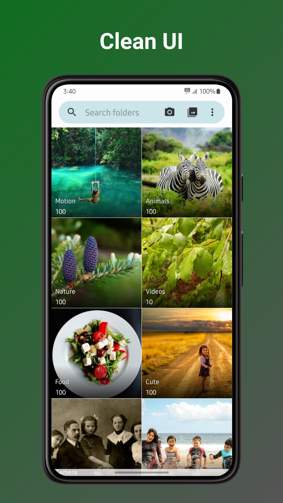
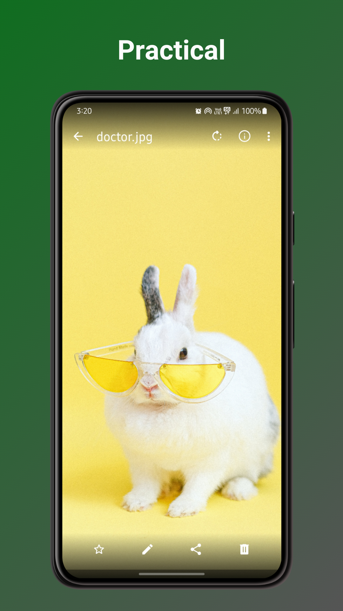
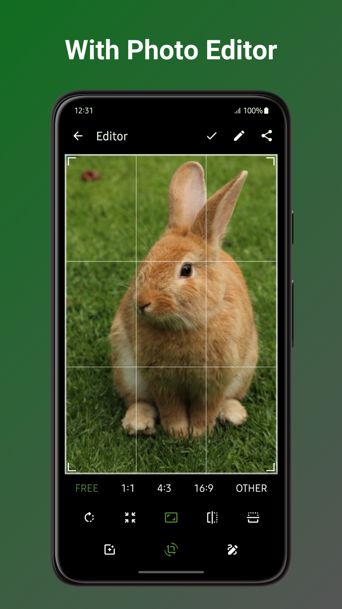

# Fossify Gallery

Unleash memories, not personal data. Fossify Gallery is the ultimate photo and video app that's as powerful as it is private. No ads, no unnecessary permissions – just a seamless experience tailored for you.

**🖼️ PHOTO EDITING AT YOUR FINGERTIPS:**

Enhance your photos with our basic yet powerful photo editor. Crop, resize, rotate, flip, draw, and apply stunning filters, all without compromising your privacy. Take control of your memories like never before.

**🌐 PRIVACY FIRST, ALWAYS:**

Your privacy matters. Ditch the data-hungry giants. Fossify Gallery puts you in control. Strip away EXIF metadata like GPS coordinates and camera details, keeping your memories yours, and yours alone.

**🔒 SUPERIOR SECURITY:**

Lock down your memories with pin, pattern, or fingerprint protection. Secure specific photos, videos, or the entire app – you decide who gets access. Peace of mind, guaranteed.

**🔄 RECOVER WITH EASE:**

Breathe easy, accidents happen! Fossify Gallery's built-in recycle bin lets you recover deleted photos and videos in seconds. No more lost treasures, just pure relief.

**🎨 YOUR GALLERY, YOUR STYLE:**

Customize the look, feel, and functionality to match your style. From UI themes to function buttons, Fossify Gallery gives you the creative freedom you crave.

**📷 UNIVERSAL FORMAT FREEDOM:**

JPEG, PNG, MP4, MKV, RAW, SVG, GIF, panoramas, videos, and more – we've got your memories covered, in any format you choose. No restrictions, just limitless possibilities.

**✨ MATERIAL DESIGN WITH DYNAMIC THEMES:**

Experience the beauty of intuitive material design with dynamic themes. Want more? Dive into custom themes and make your gallery truly unique.

